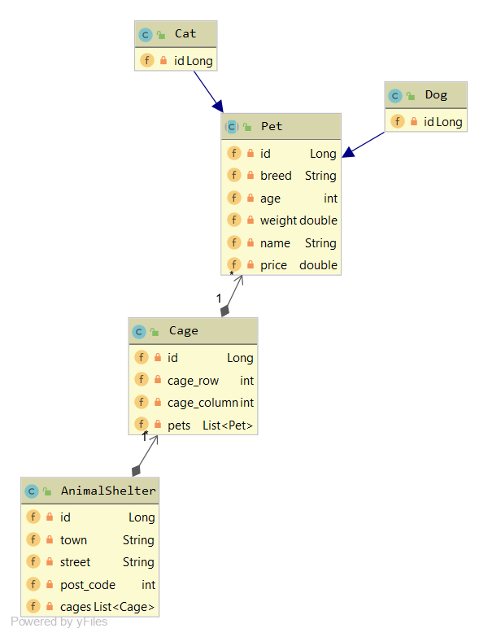
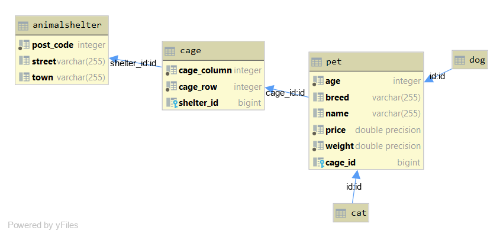

# Quarkus JPA
In this example, a animal shelter is realized.
## CLD

## ERD

## Creating/Starting the Postgres DB
`docker run --name postgres-db -p 5432:5432 -e POSTGRES_PASSWORD=password -d postgres`
## Start Project
`mvnw compile quarkus:dev`
## some Endpoints
`http://localhost:8080/api/animalShelter`
 
`http://localhost:8080/api/cage`
 
`http://localhost:8080/api/pets`
